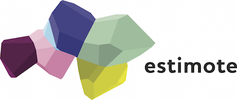

iBeacons are a cool technology that allows you to add location awareness to you apps, not based on your location on a map, but based on your proximity to iBeacons, be they at a fixed or moving point.  They allow your apps to have an accurate understanding of where you are both inside and out, from sending you offers when you are in a shop to knowing where you are in a sports stadium so you can be directed to your seat.  iBeacons are a big up and coming thing - even Facebook are now sending them out to businesses so their app can become location aware.  Companies like Estimote are creating and extending iBeacons to bring even more amazing features to the developer.

On the 8th July 2015 I'll be hosting an iBeacons mini-hack using Xamarin and Estimote beacons, at the Birmingham Xamarin Mobile Cross Platform User Group in Birmingham, UK. In this mini-hack I’ll be talking briefly about this technology and a little about it’s uses, then we’ll hit the code. Bring a Mac laptop, iPhone and lightning cable, and team up with others in building a treasure hunt app using the Estimote iOS Xamarin component and Estimote iBeacons.  There will be a prize of an Estimote developer kit or two (containing 3 iBeacons, worth $100 each) for the team that can complete the treasure hunt the fastest.

For more details and to join in visit the [Meetup page](http://www.meetup.com/Birmingham-Xamarin-Mobile-Cross-Platform-User-Group/events/223173916/).

Note - iBeacons are originally an Apple technology.  Although Estimote do have limited support for Android we will be focusing purely on their iOS Xamarin component.  The iPhone simulator also does not support iBeacons, so you will need an actual device to code against.  I will however be splitting the attendees into teams so even if you don't have an iPhone developer setup come along anyway and I'll make sure you are teamed up with someone who does.

