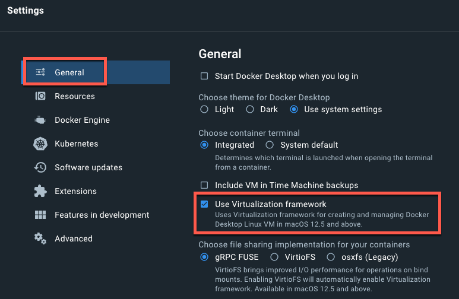

If you are an Apple user and you want to build Azure Functions using Python, then you've been out of luck. The Azure Functions core tools don't support Python functions on Arm64. There is a workaround, and this post shows you how.

## Arm64 support in Azure Functions

Apple moved to an Arm64 architecture with their Apple Silicon processors (currently M1 and M2) back in November 2020, with their entire linup now using Apple Silicon, except for the rather outdated Mac Pro. Despite this, support for running Python functions on Arm64 has not yet materialized. You can create functions with `func init` and `func new`, but when you run them, you get an error:

```bash
➜  functions-m1 func start
Found Python version 3.10.11 (python3).

Azure Functions Core Tools
Core Tools Version:       4.0.5095 Commit hash: N/A  (64-bit)
Function Runtime Version: 4.16.5.20396

[2023-05-08T21:29:33.030Z] Failed to initialize worker provider for: /opt/homebrew/Cellar/azure-functions-core-tools@4/4.0.5095/workers/python
[2023-05-08T21:29:33.030Z] Microsoft.Azure.WebJobs.Script: Architecture Arm64 is not supported for language python.
[2023-05-08T21:29:33.409Z] Failed to initialize worker provider for: /opt/homebrew/Cellar/azure-functions-core-tools@4/4.0.5095/workers/python
[2023-05-08T21:29:33.409Z] Microsoft.Azure.WebJobs.Script: Architecture Arm64 is not supported for language python.
[2023-05-08T21:29:33.558Z] A host error has occurred during startup operation '2a13f8c8-f2e4-4da0-a88c-205dbd3065c2'.
[2023-05-08T21:29:33.558Z] Microsoft.Azure.WebJobs.Script: Did not find functions with language [python].
[2023-05-08T21:29:33.564Z] Failed to stop host instance '1e7799d1-a87f-404a-9bc1-858c7724aeec'.
[2023-05-08T21:29:33.564Z] Microsoft.Azure.WebJobs.Host: The host has not yet started.
Value cannot be null. (Parameter 'provider')
```

Microsoft originally targeted support for their Python 3.10 release, but missed this. Currently they are saying it will come with Python 3.11 support, as documented in [this GitHub issue](https://github.com/Azure/azure-functions-python-worker/issues/915). Their suggested workaround involves changing your Terminal to always run under Rosetta 2 which feels like a bad way to do things. There is a better workaround, leveraging dev containers.

## Dev containers

Dev containers are docker containers that you run and connect to from VS Code. As a user these are seamless - you can still access the file system from outside of VS Code, but internally the dev environment runs in the container, with all your dependencies installed in the container instead of on your host OS. You can read about these on [the VS Code developing inside containers documentation](https://code.visualstudio.com/docs/devcontainers/containers).

Docker supports running x86 and x64 containers on Apple Silicon Macs using either QEMU emulation, or using Rosetta 2. This means you can create an x64 container and run this on your Mac, running the Azure Functions core tools inside the container! Pretty cool, hey!

## Configure docker

You need [docker](https://www.docker.com) installed, so get this installed first. Once installed, you need to configure a few things.

- From the docker menu item, select **Settings**
- From the **General** section, ensure *Use Virtualization framework* is selected

    