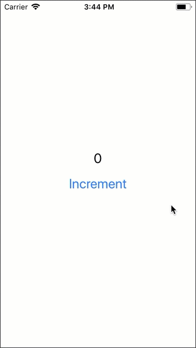
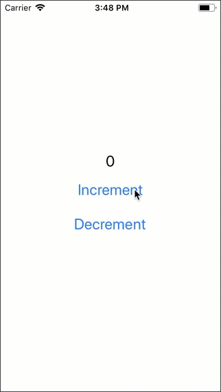

# FSharp and Xamarin

Xamarin is well known for allowing you to build mobile apps in C#, but you can use F# as well. F# is fully supported by the compiler and toolchains in both Visual Studio 2017 and Visual Studio for Mac. It's also pretty much supported by all the Xamarin tools including Xamarin.Forms ([except for one bug](https://github.com/xamarin/Xamarin.Forms/issues/2425) that should be fixed soon).

This is great for F# fans like me, but one thing that has been missing for a while has been architecture recomendations. Mobile apps, like other UI heavy apps are very object oriented. Buttons are objects, labels are objects and they fit very nicely into the classic 'OO' space. This has meant that traditionally UI apps are also built using objects - it's objects all the way down and mutable state everywhere. This doesn't match well with functional programming paradigms which try to move away from objects and mutability.

To go functional when it comes to UI, one trend is towards Elm. This is an architecture that comes from Erlang and has become popular in the F# community via [Elmish for Fable](https://github.com/elmish/elmish) for web sites. This architecture abstracts the object nature of the UI away and replaced by a purely functional model. The app runs with a function to create a view, a function to initialise an immutable model, and an update function to handle messages from either the UI or other parts of the system. The update function takes the current model and a message, and returns a new instance of the model containing a copy of the original model updated based off the message recieved. Once a new model is generated the UI is updated.

<div class="image-div" style="max-width: 410px;">
    

    
</div>

This paradigm has been ported to F# by [Don Syme](https://twitter.com/dsyme) as [Elmish.XamarinForms](https://github.com/fsprojects/Elmish.XamarinForms), an open source project also available on [NuGet](https://www.nuget.org/packages/Elmish.XamarinForms). This project provides two possible implementations of Elmish for Xamarin.Forms - known as half-elmish and full-elmish. In this post I'll look at the half-elmish implementation as this is more suited to Xamarin developers who want to move to F# (full-elmish is more suited to F# developers wanting to move to Xamarin).

### Half-Elmish

Half-elmish mixes traditional Xamarin.Forms development with the elmish architecture. At it's most basic, you define your UI using XAML, setting bindings on the UI elements as if you were using MVVM. You then implement an imutable model, an update method that handles messages that you define and returns an updated model, and a view method that configures the bindings for your UI including property bindings and commands. When a message is handled the bindings are re-evaluated and the UI updates using the normal Xamarin.Forms data binding.

#### Getting started

Start by creating a new blank Xamarin.Forms F# app using either Visual Studio 2017 or Visual Studio for Mac called **HelloElmish**. The latest versions of both will allow you to create apps with a .NET standard core project. Add the `Elmish.XamarinForms` NuGet package to all the projects in your app.

We'll create a fairly boring app, one that tracks the number of clicks of a button. Not exciting, but enough to illustrate the basics to get you started. Open the `MainPage.xaml` file, remove the contents of the `ContentPage` and add the following:

```xml
<StackLayout>
    <Label Text="{Binding Path=[Count]}"/>
    <Button Text="Increment"
            Command="{Binding Path=[Increment]}"/>
</StackLayout>
```

> Notice how the bindings are set using an array-indexer style syntax. This is part of the Elmish implementation of binding, so if you want to know more head to GitHub and dig through the source, but for now just accept that this is how we bind.

Next, lets implement the application logic. Open the `App.xaml.cs` file. We need to declare a model to track the button click count, an `enum` to define the messages our app supports, as well as three functions - `init`, `update` and `view`.

The model is fairly simple, so declare this before the `App` class declaration:

```
type Model =
    {
        Count : int
    }
```

Next up, add an enum type for the messages that the update function will handle:

```
type Msg =
    | Increment
```

Now we need to implement the `init` method. This is called when your app starts up to create the initial model, so add this function to the `App` class:

```
let init () = { Count = 0 }
```

This creates a new model with the count set to 0. Next is to add a function to handle a message to increment the counter. This takes a message and a model, so add this to the `App` class:

```
let update msg model =
    match msg with
    | Increment -> { Count = model.Count + 1 }
```

This function matches the message with the `Increment` message, and if it matches returns a new model with the `Count` set to the count of the previous model plus one. It may seem overkill to match when we only have one message type, but we'll add another message type later. Notice how it is always a new model that is returned - the `Model` type is immutable so we always have to create a new copy.

After the `update` function we need to add the `view` function to the `App` type. This is used to create bindings between the UI, the model and the messages. This function returns a tuple of a Xamarin.Forms page and a list of bindings:

```
let view () =
    MainPage(),
    [ "Count" |> Binding.oneWay (fun m -> m.Count.ToString())
      "Increment" |> Binding.msg Increment
    ]
```

You'll need to open the following modules at the top of the file for this to compile:

```
open Elmish.XamarinForms
open Elmish.XamarinForms.StaticViews
```

This view method defines two bindings. One is a one way binding for the `"Count"` property that binds the value to a function that returns the `Count` from the model converted to a string. The next is a binding from the `"Increment"` command to the `Increment` message.

When the app is launched this `view` function is run and the page is created. The values of the bindings are evaluated and set. The `oneWay` binding sets the value on the Label based on the return value of the function, and the `msg` binding binds the button command property to a command created for you by the elmish implementation. Executing this command calls the `update` function passing in the `Increment` message and the current model.

When the button is clicked, this command is executed, calling the `update` function. The new model that comes back from this function call is then passed through the bindings again, and if the values returned from the bindings is different from the previous value the UI widget gets updated. In our case, the `update` method increments the count, so the value of the one way binding would increment from 0 to 1, and the UI would be updated to show 1.

The final thing to do is wire everything up to make the app kick off the elmish functions. Add the following to the `App` class:

```
let runner = 
    Program.mkSimple init update view
    |> Program.withStaticView
    |> Program.run

do base.MainPage <- runner.InitialMainPage
```

In addition, remove the setting of the `MainPage` when inheriting from `App`:

```
type App() =
    inherit Application()
```

This code creates a `runner` that creates an elmish program using our `init`, `update` and `view` functions. It uses a static view that tells elmish that the page is created once and updated via binding. The __full-elmish__ implementation doesn't use XAML pages, instead it creates the UI on the fly and the whole UI is rebuilt after each update (with a lot of logic inside the elmish code to reuse stuff for performance). Full-elmish is outside the scope of this post.

This runner has an initial main page property that is set as the `MainPage` for your `App` class. The elmish architecture supports navigation and multiple pages, and I'll cover this in a later blog post.

Build everything and run the app. You'll be able to click the button and see the count increment.

<div class="image-div" style="max-width: 322px;">
    

    
</div>

#### Getting more advanced

Lets make this a bit more advanced by adding a decrement button. Start by adding a new button to the `StackLayout`:

```xml
...
<Button Text="Decrement"
        Command="{Binding Path=[Decrement]}"/>
...
```

Next add a message type for this:

```
type Msg =
    | Increment
    | Decrement
```

Then add code to the `update` function to handle this message:

```
let update msg model =
    match msg with
    | Increment -> { Count = model.Count + 1 }
    | Decrement -> { Count = model.Count - 1 }
```

Then finally wire up the message in the `view` function:

```
let view () =
    MainPage(),
    [ "Count" |> Binding.oneWay (fun m -> m.Count.ToString())
      "Increment" |> Binding.msg Increment
      "Decrement" |> Binding.msg Decrement
    ]
```

Run the app and you'll be able to increment and decrement the value.

<div class="image-div" style="max-width: 322px;">  
    

    
</div>

The code for this is on [GitHub](https://github.com/jimbobbennett/HelloElmish).

### Learn more

We've seen a very simple example of how to use F# to build Xamarin.Forms apps using the elmish architecture. For a more complicated example, check out my [Tic Tac Toe game on GitHub](https://github.com/jimbobbennett/TicTacToe) or any of the [Elmish.XamarinForms samples](https://github.com/fsprojects/Elmish.XamarinForms/tree/master/Samples).

Also check out my video from [F#Conf](http://fsharpconf.com) on using F# to build Xamarin apps below or on [Channel9](https://channel9.msdn.com/Events/FSharp-Events/fsharpConf-2018/05/?WT.mc_id=fsharpconf-channel9-jabenn), and don't forget there is plenty of official [Xamarin F# documentation](
https://www.microsoft.com/net/learn/languages/fsharp/?WT.mc_id=fsharp-blog-jabenn) available.

<iframe src="https://channel9.msdn.com/Events/FSharp-Events/fsharpConf-2018/05/player" width="960" height="540" allowFullScreen frameBorder="0"></iframe>

