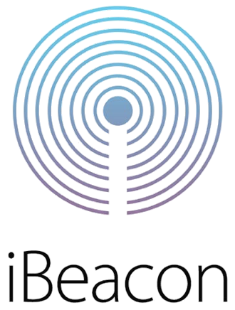

    

    

 

So in preparation for my [upcoming iBeacon mini-hack](http://www.meetup.com/Birmingham-Xamarin-Mobile-Cross-Platform-User-Group/events/223173916/) I've been thinking about iBeacon security.  For such a simple device, there is a lot of complex issues around their security to consider.

###### iBeacons are defined by their UUID and version

A simple statement but with large undertones.  An iBeacon is defined by it's UUID and version - something it broadcasts publicly to the world and is not locked down.  There is nothing stoping you reading the id of an iBeacon and setting your app to detect it or your own iBeacon to use it.

Imagine the scenario - [UK supermarket Asda are trailing iBeacons](http://ibeaconsblog.com/asda-trials-in-store-beacons/) to send customers offers and highlight their cheaper prices.  The Asda app will monitor for the particular UUID/version combinations (or maybe just the UUID) and when it detects an iBeacon will send a notification to your phone with information.  But whats to stop a rival supermarket doing the same thing?  All it takes is someone to scan the iBeacons, get their Id's and register them in the app for the rival supermarket - you walk into Asda and get a notification that the average basket of shopping is cheaper somewhere else.  They could even get down to the level of individual offers - if Asda have an offer linked to a particular iBeacon version the rival app could detect the same version and show a price comparison.
There is nothing that can be done to stop this - Apple will let you monitor for any UUID, they don't limit it based on your app.  If two apps are listening for the same UUID they will both notify when the iBeacons are detected and nothing can be done to stop it.  I have heard that in iOS 8.3 only one app will respond, I haven't had time to test this yet but in such a case how do you know the right app will respond?

Conversely what is to stop someone depositing iBeacons in a shop that doesn't support them.  If a companies app responds to iBeacons what would stop them from doing guerrilla marketing and dropping iBeacons all around another similar store that causes notifications on their app to guide you away from the store you are in and into their store.  Or even environmental activists dropping beacons that send notifications to their app when you use a store that goes against their principles.

A lawyer would be able to provide legal information on this, but I can't imagine it is illegal to have an app for supermarket A monitor iBeacons owned by supermarket B until a test case comes to court.

###### iBeacons can be spoofed

Yup - they can be.  There is nothing stopping you setting the UUID/version to be whatever you want.  iBeacons come with a default UUID so you can connect from the suppliers app and you then update the iBeacon to whatever UUID/version you want.  So there is nothing stopping you setting the UUID to match someone else's iBeacon and causing mischief or mayhem or worse.

Imagine a restaurant uses iBeacons placed on each table to allow their app to locate you at that table.  You can order from the app and your food comes over.  You then pay from the app - it knows where you are sitting so it knows what bill you are paying.  But imagine if someone spoofed the id of your table to match the id of theirs - maybe by sending a much stronger signal from another device.  Without realising it you've just paid for someone else's lunch.

Imagine a worse scenario.  iBeacons are great in stadiums to help locate your seat.  In the event of an emergency a notification can be sent to your phone and based off your location you can be directed to the nearest exit.  But in a terrorist scenario, what would stop them deploying iBeacons around so the app cannot locate you, or causes you to be directed towards the threat instead of away.  This could lead to loss of life that is not easily prevented.

###### iBeacons can be hacked

Yup - they can be hacked.  The mechanisms used to update the iBeacons from the factory can be used to update them maliciously.  This is less of an issue as there are ways to secure access (for example the [Estimote cloud](https://cloud.estimote.com)), but if they are not secured what is to stop someone walking around a shop and changing all the UUID's to match a rivals iBeacons so the rivals app is launched instead of the stores app.  In these scenarios it's easy to catch the rival so I can't image a reputable company doing it - but activists might.

###### How to get round this?
Estimote offer [Secure UUID's](https://community.estimote.com/hc/en-us/articles/204233603-How-Secure-UUID-works-) which claim to constantly change the UUID but allow your app to range for the iBeacons despite the UUID changing.  I haven't tried this out yet, but will do so soon and report back.  Other than this, there is not much that can be done.  I'm hoping Apple will allow you to lock down a range of UUID's that your app can monitor for to disallow other apps for using them but I guess we will have to see what they do once iBeacon security hits the news.

For more reading about this, I recommend this [Fantastic blog post on the Estimote site](http://blog.estimote.com/post/104765561910/ibeacon-security-understanding-the-risks).

