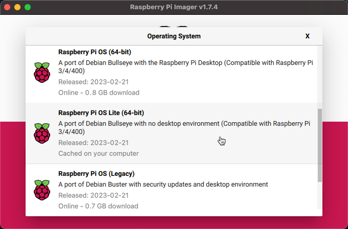

> TL;DR - use Raspberry Pi OS 64-bit if you want to run Appwrite on a Pi

I've started working on a personal project, so thought it might be fun to give [Appwrite](https://appwrite.io) a spin. Appwrite is an open-source app backend for web and mobile projects, you can think of it as a competitor to Firebase.

Rather than use a hosted version, or try to run it on Azure and burn through my credits, I decided to run it on a local server. I have a few Raspberry Pi's kicking round, so thought Id try running it on there.

## Hardware

Appwrite claims to run on as little as 1 CPU and 2GB of RAM, so a Pi 4 with 4GB should be more than enough. I have one spare, so set it up.

## Raspberry Pi OS

The first thing to note is that Appwrite does run on Arm, but only Arm64. The 'default' Raspberry Pi OS is the 32-bit version, and Appwrite will not run on this. Instead, when you set up your SD card, you need to use Raspberry Pi OS 64-bit. In my case I'm using the lite version as I want to run this as a headless server.



I installed this on an SD card, then booted up my Pi 4.

## Configuring the software

Appwrite runs as a docker container, so the first thing to do is install docker. The [convenience script](https://docs.docker.com/engine/install/debian/#install-using-the-convenience-script) from docker works perfectly on the Pi:

```bash
curl -fsSL https://get.docker.com -o get-docker.sh
sudo sh ./get-docker.sh
```

Takes a while, but this sets up docker. I then like to add the current user to the `docker` group to save `sudo`ing all the things.

```bash
sudo usermod -aG docker $USER
```

Now docker is installed, you can install Appwrite. Appwrite has 2 ways to do this - a quick install and a manual install. I decided to do the manual install in case I needed to configure things later.

You start by creating a folder to run from on your Pi, then downloading a docker compose and .env file:

```bash
mkdir appwrite
cd appwrite

curl -o docker-compose.yaml https://appwrite.io/install/compose
curl -o .env https://appwrite.io/install/env
```

From here, you can build the container and start it up:

```bash
docker compose up -d
```

This runs the container detached - as in it runs in the background, returning to the current session. If you close your shell it will stay running.

Once I had this running, I could then open Appwrite by accessing my Pi from a browser. Appwrite runs on port 80, so listens to default HTTP requests on the Pi. From there, create a new account to access the server.


