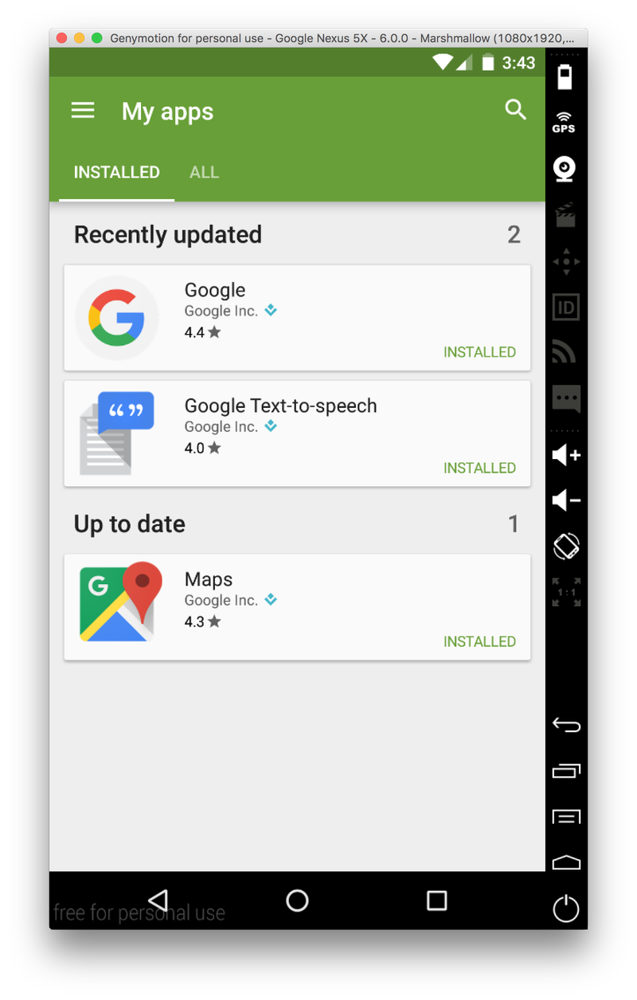

I've been trying to play with the [Google Nearby Message API](https://developers.google.com/nearby/messages/overview) recently as this has capabilities to talk to Eddystone beacons.  The problem I've come up against is that the example code uses the new Marshmallow permissions so I'm having a bit of a headache getting it working.

I've got a Tesco Hudl 2 as my only physical device, and thanks to the annoying way Android is repackaged by each hardware provider I can't update it past Lollipop.

The other option is an emulator, but these need Google Play services to enable the Nearby APIs.

You'd think this would be easy, it's a pretty normal thing to do.  Unfortunately it's not so easy.  All the emulators don't come with these by default, which seems a strange oversight.  Instead you need to install them later.  Again, you'd expect this to be simple.  But it's not - at least not for Marshmallow.  It's taken about 6 hours of downloading, trying and googling to get it working.

So here's how.  All links mentioned are working at the time of writing.

First, install [GenyMotion](https://www.genymotion.com).  Normally I would be extolling the virtues of Xamarin Android Player, but in this case I could not get their Marshmallow preview to work by following the Xamarin instructions.

Next create a new virtual device - I've been using the **Google Nexus 5X - 6.0.0 - API 23 - 1080x1920** image.  Start this up.

Then you need to install an ARM translator, this is available [here](https://www.androidfilehost.com/?fid=23252070760974384).  Download it, drag it on to the running emulator.  A dialog will pop up asking if you want to flash the ROM, click yes and let it install.  Once done reboot the device from the ADB command prompt using the command: 

```
adb reboot
```

Then close and re-open the emulator.

After the translator you need to install the Lollipop version of the Google Apps package from [here](https://www.androidfilehost.com/?fid=96042739161891406).  Yup - the Lollipop version.  Same as for the translator, drag it on, click yes, then reboot using ADB once done.

Once the Google Apps are installed, from Settings -> Accounts log in with your Google account.

Now update to the Google Apps for Marshmallow, which is available [here](https://www.androidfilehost.com/?fid=24052804347835438).  Install, reboot as before.  It's important that you log in **before** installing the Marshmallow version, otherwise logging in just won't work.

Now you can launch the Google Play Store and install and update apps as required.

Done - An overly complicated solution to what should be a simple thing.

<div class="image-div" style="width: 500px;"> 
    

    
</div>

<hr/>

#### Update

A much better description with proper credit to everyone involved is up here, courtesy of [@cheesebaron](https://twitter.com/Cheesebaron):

http://blog.ostebaronen.dk/2016/04/installing-gapps-in-visual-studio.html

