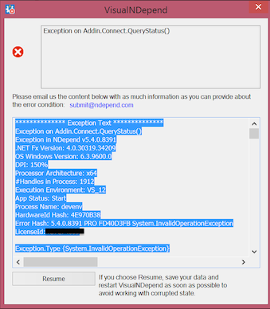

Patrick from [NDepend](http://www.NDepend.com) reached out to me today to ask me to review NDepend.  Having dabbled with it a while ago, I was more than happy to say yes and try out the latest version.

If you've never heard of NDepend before, it's a code quality tool.  It analyses your code and provides a number of quality metrics such coupling and cyclomatic complexity - check out all the features [here](http://www.ndepend.com/features/).  These are a good way to get an overview of the general quality of your code - it doesn't tell you if your code works but gives a view on how well coded your application is.  For example, a high [cyclomatic complexity](http://en.wikipedia.org/wiki/Cyclomatic_complexity) means you have a lot of code paths - this doesn't mean your code is broken but it does mean it will be harder to read and maintain.  And as every developer knows, the largest portion of your job is maintaining code, so we want it to be as easy as possible.

I like having these kind of metrics available, along with measurements like unit test count and coverage.  What I look for in these is both the numbers as well as trends.  If the complexity is going down, the unit test count is going up and the coverage is staying high or increasing then I know I and my team are working to keep the quality up or improving.  Any negative trends mean that things are potentially getting worse so things need to change.  These kind of tools are great locally so you can monitor your code before check in, but more important as part of continous integration and delivery - allowing you to monitor the trends across builds and even block check ins or fail builds if metrics move too far in the wrong direction.

NDepend works as a stand alone tool, a Visual Studio plugin and with a build server.  One big downside for me is it doesn't run on the Mac - I'm developing iOS apps in .Net using Xamarin so need my build agent running on a Mac.  So lets start the review from the beginning - installation.

The 'installer' is a zip file, so you can just dump it anywhere.  This makes it easier in corporate environments with locked down admin.  Once unzipped and the license file dropped in, I started with the Visual Studio add-in as my prefered workflow is to do everything from VS before check in.  I closed all Visual Studio instances that I had open, ran the add in installed, told it to install into VS 2013.  I then launched my first solution - a Xamarin.Forms app and the NDepend menu was there.
I then loaded a second solution to help me test my app - this one is a Node.js solution that I use for my apps back end.  As it's loading I get this:

Not a good start.  I had to close 8 of these then wait a minute before VS became responsive.  I closed and tried again - the same.  I then closed all instances of VS and tried again - same same.  I then tried another Node solution and this worked.  Seems it only happens with my main app backend soluton.

Obviously I can't carry on like this, so I've sent the details to NDepend support and uninstalled it.  NDepend does provide a standalone tool for doing this analysis, but my preferred workflow is to do all my unit testing/coverage checking/static analysis inside Visual Studio before check in.

**Update**

To me a good measure of a person or company is not if they make mistakes but how they deal with them.  In the case of NDepend they have been excellent.  Their support team have been working with me to help address this issue - including making a good effort to try to reproduce the issue with no success.
My code contains proprietry IP so I couldn't just send it to them, so I've been trying to reproduce the issue in something I can send.
Turns out, I can't reproduce it either.  It only happens with my Node soution run from one folder - if I copy the whole folder somewhere else it works.  In the end the fix was simple - delete everything and re-clone from git.  Once I did this, everything worked for a while - then VS crashed and the error returned.
It does seem as there are issues with NDepend and Node projects including crashing when right clicking on folders.  Luckily the Node tools team are on it and have [addressed it for a future release](https://nodejstools.codeplex.com/workitem/1332).

Once I'm up and running I'll be putting NDepend through it's paces with [JimLib](https://github.com/jimbobbennett/JimLib) and adding more posts.

 

*The features described and my opinions are based on my time spent with NDepend.  If anything is incorrect please feel free to correct me and I will update this review*

