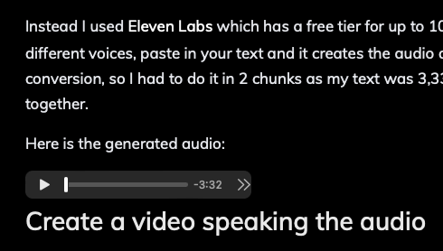

I was writing a post today and wanted to embed an mp3 file of some text to speech output. Hugo doesn't support this natively using shortcodes, so I needed a way to add these, ideally without adding any HTML.

To do this, I needed to create my own shortcode implementation. As it turns out, based on the [Hugo shortcode guide](https://gohugo.io/templates/shortcode-templates/), these are not to complicated.

## Create the shortcode

Shortcodes live in a folder called `shortcodes` in your `layout` folder and are implemented as HTML files, named as `<shortcode>.html`. For example, if you wanted to create a shortcode called `audio` you would create the file `layout/shortcodes/audio.html`.

Shortcodes are snippets of HTML that can be passed named parameters. The HTML for an HTML audio player is:

```html
<audio controls preload="auto">
    <source src="file.mp3">
</audio>
```

Shortcodes can also be parameterized with name parameters that you can get using the `{{ .Get "name" }}` method, passing the name of the parameter. For the audio shortcode, I need to pass in the audio file, so this can be a parameter. This is set in the `src` field, so I called this parameter `src`:

```html
<audio controls preload="auto">
    <source src="{{ .Get "src" }}">
</audio>
```

Done! This is my entire shortcode.

## Use the shortcode

Once my shortcode was written, it was easy to use. I added the mp3 file I want to play to the folder for my blog post, and added the shortcode tag in the markdown file for the post:

```md

```

Once done, the audio player appears on my page:



## Use this yourself

If you want to use this shortcode, you can find it [on the GitHub repo for this site](https://github.com/jimbobbennett/jims-blog/blob/main/blog/layouts/shortcodes/audio.html).
