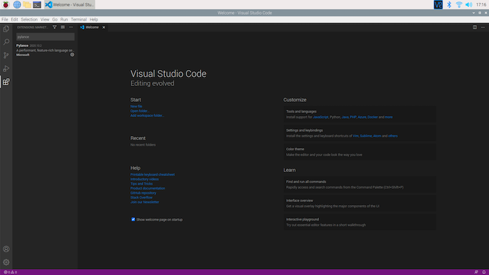

It's finally here! An official supported version of VS Code that runs on a Raspberry Pi!



This to me is great news. [The Raspberry Pi](https://raspberrypi.org/) is a low-priced, small form factor computer that can run a full version of Linux. It's popular with hobbyists and kids - it was originally designed to be a cheap computer for kids to learn to code on. It has the same standard USB and HDMI ports that a PC or Mac would have, as well as GPIO (General Purpose Input Output) pins that can be used to work with a wide array of external electronic components, devices, sensors, machinery and robotics.

What this VS Code release means is kids who are using a Pi can now use the same IDE that their grown ups use at work - Mum codes C# in VS Code at work and daughter codes Python in VS Code on a $35 computer at home connected to the family TV.

Lets look at how to get it set up.

## Installing VS Code on a Raspberry Pi

**STOP THE PRESS**

VS Code is now in the Raspberry Pi apt repositories. You can install it by launching a terminal and running the following command:

```bash
sudo apt update
sudo apt install code -y
```

## Using VS Code

Once the installer has finished, you will see Visual Studio Code as an option in the programming folder in the Pi menu. Select it to launch VS Code.


You can now install your favourite extensions and program away! Be aware that not all extensions will work fully!

