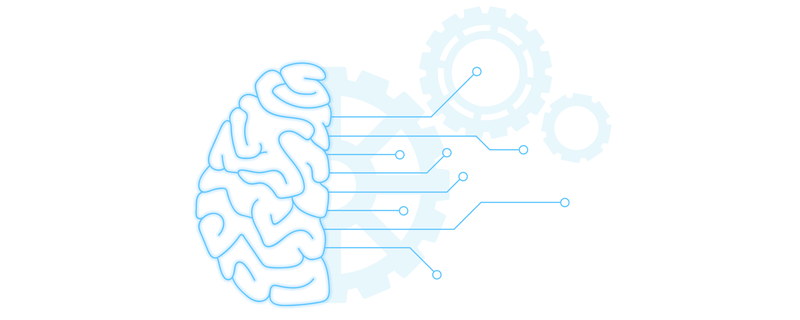
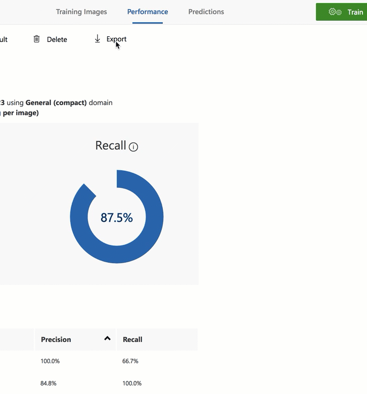

Recently I [wrote about creating AI models](/blogs/identifying-my-daughters-toys-using-ai-part-5-plugin-for-on-device-models/) using the [Azure Custom Vision Service](https://customvision.ai). In these posts I looked at creating and training models, running them online, then finally exporting the models to run on iOS using CoreML and Android using TensorFlow.

Recently Microsoft announced another way to export models - as [ONNX models](https://github.com/onnx/onnx) that can be run using [Windows ML](https://docs.microsoft.com/en-us/windows/uwp/machine-learning/?WT.mc_id=toyidentifier-blog-jabenn). Like with CoreML and TensorFlow, these are models that can be run on-device, taking advantage of the power of the devices GPU instead of needing to be run in the cloud.

<div class="image-div" style="max-width:400px;">
    

    
</div>

ONNX models can be exported in the same way as CoreML and TensorFlow - select you iteration, click the __Export__ button to generate the model, then the __Doanload__ button to download it.

<div class="image-div" style="max-width:500px;">
    

    
</div>

To use this model you need a UWP app targeting Build 17110 or higher of the Windows SDK (as this version is the first one containing the Windows ML API). Create a new app, then drag your downloaded model into the `Assets` folder. When you add the model, some wrapper classes will be created inside a file in the root directory of your app with a really weird name - they will all start with the Id of your model converted into a format that is C# friendly. The three classes that will be created are for inputs, outputs and running the model - and will end with `ModelInput`, `ModelOutput` and `Model`.

It would make sense to rename them, so rename the file to something sensible that reflects your model, then rename the classes as well to `ModelInput`, `ModelOutput` and `Model`.

* `ModelInput` is the input to the model and contains a single property called `data` which is a `VideoFrame`. You can populate this with a capture from the camera or a frame from a video feed.
* `ModelOutput` is the outputs of the model as a dictionary of strings to floats. The dictionary is auto-populated with the tags from the model, and when the model is run this will be updated to set the percentages for each tag.
* `Model` is the class that evaluates the model, binding the inputs and outputs and executing the model.

To create a model, use the static `CreateModel` method on `Model`, passing in the `<model>.onnx` file as a `StorageFile`, loaded like this:

```cs
var file = await StorageFile.GetFileFromApplicationUriAsync(new Uri($"ms-appx:///Assets/<model>.onnx"));
```

To run the model, capture a `VideoFrame`, set it on an instance of `ModelInput`, then pass that to the `EvaluateAsync` method on the model. This will return a `ModelOutput` with the probabilities set.

You can find a sample of this in the [GitHub Azure Samples repo](https://github.com/Azure-Samples/Custom-Vision-ONNX-UWP). You can also learn more by checking out the [docs](https://docs.microsoft.com/en-us/azure/cognitive-services/custom-vision-service/custom-vision-onnx-windows-ml/?WT.mc_id=toyidentifier-blog-jabenn).

